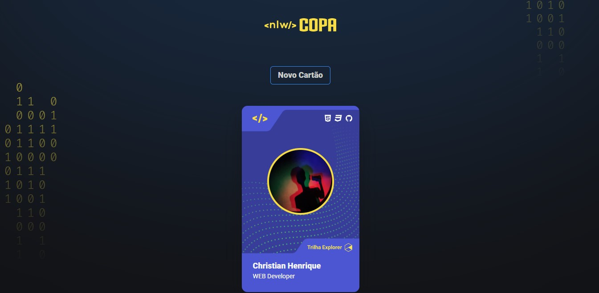

<h1 align="center"> NLW Esports </h1>

Projeto feito apartir de uma aula gratuita da Rocketseat para ensino de tecnologias WEB.

  <a href="#-tecnologias">Tecnologias</a>&nbsp;&nbsp;&nbsp;|&nbsp;&nbsp;&nbsp;
  <a href="#-projeto">Projeto</a>&nbsp;&nbsp;&nbsp;|&nbsp;&nbsp;&nbsp;
  <a href="#-layout">Layout</a>&nbsp;&nbsp;&nbsp;|&nbsp;&nbsp;&nbsp;
  <a href="#memo-licença">Licença</a>

  

 

## 🚀 Tecnologias

Esse projeto foi desenvolvido com as seguintes tecnologias:

- HTML e CSS
- JavaScript
- Git e GitHub

## 💻 Projeto

Este projeto disponibiliza informações sobre os usuários para os visitantes da página, sendo eles seus interesses e como contatá-lo

## 🔖 Layout

Você pode visualizar o projeto através [DESSE LINK](https://nesdark.github.io/nlw-figurinha/).

## :memo: Licença

Esse projeto está sob a licença MIT.

---

Feito com ♥ by Christian :wave: [Participe da comunidade de Devs da Rocketseat ](https://discord.gg/rocketseat)
